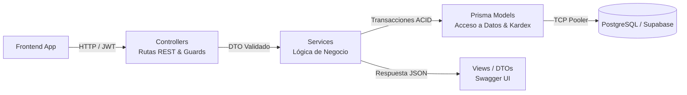

# Sistema de Facturación e Inventario - Farmacia La Sana (Backend)

API backend desarrollada en NestJS con Prisma ORM y PostgreSQL (alojada en Supabase) para la gestión centralizada de 4 sucursales de farmacia. Cuenta con documentación interactiva en Swagger y autenticación basada en JWT.

---

## Contexto y Reglas de Negocio

El sistema está diseñado para resolver los tres dolores operativos principales de la cadena:
1. **Desbalance de inventario entre sedes:** Permitir traslados ágiles desde una sucursal con sobrestock/baja rotación hacia otra con desabastecimiento/alta rotación.
2. **Pérdida por vencimientos:** Control por lotes y alertas preventivas antes de que los medicamentos caduquen.
3. **Control en punto de venta:** Validación obligatoria de recetas para medicamentos controlados y control de apertura/cierre de cajas para evitar descuadres de dinero.

### Roles del Sistema

* **Dueño:** Acceso total a reportes financieros consolidados, métricas globales de las 4 sedes y gestión de empleados/gerentes.
* **Gerente General:** Monitoreo de stock de las 4 sucursales en tiempo real, creación y despacho de traslados entre sedes, registro de compras a proveedores, consulta general de ventas y ajustes por merma.
* **Cajero / Farmacéutico:** Limitado a su sucursal asignada. Apertura y cierre de caja, registro de ventas (validando stock, vencimiento y receta), consulta de clientes y recepción física de traslados que llegan a su sede.

### Flujos Principales

1. **Venta y Facturación:**
   * La venta solo procede si el cajero tiene un turno de caja en estado `ABIERTA`.
   * Si el producto tiene la marca `requiere_receta = true`, es obligatorio asociar una receta médica vigente del cliente.
   * **Semáforo de Vencimientos FEFO:**
     * 🛑 **Vencido ($\le 0$ días):** Venta bloqueada. Solo permite baja por merma.
     * 🔴 **Crítico ($1 \text{ a } 29$ días):** Venta bloqueada en mostrador (evita riesgo sanitario y reclamos). Sugerido para traslado urgente a sede con alta rotación o merma.
     * 🟡 **Preventivo ($30 \text{ a } 90$ días):** Venta permitida con prioridad de despacho FEFO (sale antes que los lotes nuevos).
     * 🟢 **Normal ($> 90$ días):** Stock en rango seguro.
   * El descuento de stock y el registro en `kardex_movimiento` se procesan dentro de una misma transacción atómica (`prisma.$transaction`). Si algo falla, se revierte todo.

2. **Consulta de Stock Inter-Sucursal (Solo Agotados):**
   * El cajero solo puede ver las existencias de su propia sucursal.
   * **Excepción controlada:** Si un producto está completamente agotado en su sede (`stock = 0`), el cajero puede consultar el stock de ese producto en las otras 3 sucursales para orientar al cliente. Si aún tiene existencias en su sede, el backend rechaza la consulta intersede.

3. **Cierre de Caja:**
   * El cajero ingresa el dinero físico contado.
   * El sistema calcula automáticamente el monto esperado: `monto_inicial + total_ventas_del_turno`.
   * Se calcula la diferencia (`monto_fisico - monto_esperado`). Si no cuadra (diferencia != 0), queda registrado el descuadre con su respectiva observación para auditoría.

4. **Traslados entre Sucursales:**
   * **Paso 1 (Origen / Gerente):** Se solicita el traslado indicando sede origen, sede destino, lote y cantidad. El backend valida stock y lo descuenta de inmediato en la sede origen para que no se venda por error. El estado pasa a `EN_CAMINO` con su movimiento de salida en kardex.
   * **Paso 2 (Destino / Cajero):** Al llegar el producto a la sede destino, el cajero revisa el paquete. Si falta algo o llega dañado, anota la irregularidad. Al confirmar, el stock entra al inventario de la sede destino y el estado cambia a `COMPLETADO`.

5. **Seguridad y Acceso:**
   * Contraseñas encriptadas con bcrypt.
   * Control de intentos fallidos: si un usuario falla la contraseña 3 veces seguidas, la cuenta se bloquea por 1 hora.

---

## Arquitectura (MVC en NestJS)

Para cumplir con el patrón MVC solicitado, la estructura del proyecto se organiza de la siguiente manera:

* **Modelo (M):** Manejado a través de Prisma Client (`schema.prisma`) contra PostgreSQL. Encapsula las entidades de base de datos y la persistencia transaccional (Kardex, stock, ventas).
* **Controlador (C):** Controladores de NestJS (`@Controller`) que exponen las rutas REST, reciben los requests, ejecutan validaciones con class-validator y llaman a la capa de servicios.
* **Vista (V):** Respuestas estructuradas en formato JSON y documentación interactiva expuesta mediante Swagger UI (`/api/docs`).



### Estructura del Código

```text
src/
├── common/              # Guards de JWT/Roles, decoradores, filtros globales y DTOs base
├── prisma/              # PrismaService y PrismaModule para conexión a BD
└── modules/             # Módulos organizados por dominio
    ├── auth/            # Login, JWT y bloqueo de intentos fallidos
    ├── cajas/           # Turnos de caja, arqueos y detección de descuadres
    ├── clientes/        # Registro y consulta de clientes
    ├── recetas/         # Validación de recetas médicas
    ├── ventas/          # Venta transaccional, regla FEFO y alertas de sucursal
    ├── productos/       # Catálogo y bandera requiere_receta
    ├── lotes/           # Fechas de vencimiento y números de lote
    ├── proveedores/     # Directorio de proveedores
    ├── compras/         # Entrada de mercancía a sucursales
    ├── traslados/       # Despacho y recepción entre sucursales
    ├── inventarios/     # Ajustes de inventario y registro de mermas
    └── reportes/        # Stock multisede en tiempo real y reportes financieros
```

---

## Instalación y Ejecución en Local

### Requisitos
* Node.js v18 o superior
* npm v9 o superior

### Pasos

1. Clonar el repositorio y entrar a la carpeta del backend:
   ```bash
   cd backend
   ```

2. Instalar dependencias:
   ```bash
   npm install
   ```

3. Configurar el archivo `.env` en la raíz de `backend/`:
   ```env
   pidanlo
   ```

4. Generar el cliente de Prisma:
   ```bash
   npx prisma generate
   ```

5. Iniciar en modo desarrollo:
   ```bash
   npm run start:dev
   ```

La API quedará escuchando en `http://localhost:3000`.  
La documentación Swagger para probar los endpoints estará disponible en:  
**`http://localhost:3000/api/docs`**

---

## Comandos de Base de Datos (Leer antes de tocar)

**CUIDADO CON LA BASE DE DATOS:**  
La base de datos en Supabase ya tiene el esquema final con llaves foráneas, restricciones únicas y columnas calculadas.  

* **NO USAR:** `npx prisma db push` (puede desconfigurar columnas calculadas y restricciones).
* **NO USAR:** `npx prisma migrate reset` (borra todas las tablas y datos de Supabase).
* **Comandos seguros:**
   * `npx prisma generate` (compila los tipos locales de TypeScript).
   * `npx prisma db pull` (solo lee la BD y refresca `schema.prisma`).
   * `npx prisma studio` (abre un visor web en `http://localhost:5555` para ver los datos).

---

---

## Hoja de Ruta - Fase 1 (MVP 50% Funcional del Backend)

Para entregar un primer producto mínimo viable completamente funcional y testeable en Swagger, el backend se ha dividido en dos fases:
* **Fase 1 (MVP actual - 50%):** Ciclo operativo completo de la farmacia (Autenticación, Turnos de Caja, Catálogo/Stock con FEFO, Clientes, Recetas y Motor de Ventas transaccional).
* **Fase 2 (Siguiente 50%):** Logística y Gerencia (Traslados inter-sucursales, Compras a proveedores, Mermas y Reportes globales).

---

## División del Trabajo en Dupla (Fase 1)

El 50% correspondiente a la Fase 1 está dividido equitativamente en dos frentes de desarrollo independientes y desacoplados para evitar conflictos en Git:

### Lucho: *Seguridad, Control de Caja y Personas (Implementado y Verificado ✅)*

#### 1. Módulo `auth` (Seguridad y Sesión)
* **`POST /auth/login`**:
  * **Request Body:** `{ "nombre_usuario": string, "password": string }`
  * **Respuesta 200:**
    ```json
    {
      "access_token": "eyJhbGciOi...",
      "usuario": {
        "id_usuario": 1,
        "nombre_usuario": "cajero1",
        "id_empleado": 10,
        "id_sucursal": 1,
        "rol": "Cajero",
        "nombres": "Carlos",
        "apellidos": "Gómez"
      }
    }
    ```
  * **Protección contra Fuerza Bruta (En memoria con Map y TTL 3600s):**
    * Si un usuario acumula **3 intentos fallidos consecutivos**, la cuenta queda bloqueada por **1 hora** (3600s) sin alterar la BD.
    * Cualquier intento subsiguiente durante la hora de bloqueo es rechazado de inmediato sin tocar la base de datos ni gastar CPU en bcrypt:  
      `401 Unauthorized: "La cuenta se encuentra bloqueada temporalmente por exceso de intentos fallidos. Intente nuevamente en X minuto(s)."`
    * **Anti-Enumeración de Usuarios (OWASP):** La respuesta de error y el bloqueo aplican de forma idéntica tanto a usuarios existentes como inexistentes, impidiendo a terceros adivinar nombres de usuario válidos.
    * Un inicio de sesión exitoso reinicia el contador de fallos a cero de inmediato.
  * **Auditoría:** Cada login exitoso genera un registro en la tabla `auditoria_empleado` (`accion: 'LOGIN'`, `modulo: 'auth'`).
* **`GET /auth/perfil`**:
  * **Headers:** `Authorization: Bearer <token>`
  * **Respuesta 200:** Información del usuario autenticado, vinculación a su empleado, rol y sucursal (campo `password_hash` excluido).
* **Infraestructura de Seguridad Común:**
  * `@Roles('Cajero', 'Gerente', 'Dueño')`: Decorador de autorización declarativa.
  * `@CurrentUser()`: Decorador de parámetro para inyección directa del usuario del token.
  * `JwtAuthGuard` y `RolesGuard`: Guards de protección JWT y validación estricta de rol (arrojando `403 Forbidden` ante insuficiencia de permisos).

#### 2. Módulo `cajas` (Control de Turnos y Arqueos)
* **`POST /cajas/apertura`** (`@Roles('Cajero', 'Gerente')`):
  * **Request Body:** `{ "id_caja": number, "monto_inicial": number }`
  * **Reglas de Negocio:**
    1. Valida que la caja física exista y esté en estado `activa: true`.
    2. Valida que el empleado en sesión **no tenga ya otro turno abierto** (`estado: 'ABIERTA'`).
    3. Valida que la caja física seleccionada **no esté ocupada** por otro turno abierto.
    4. Registra en `cierre_caja` con estado `ABIERTA`, `fecha_apertura` actual y `monto_esperado = monto_inicial`.
* **`POST /cajas/cierre`** (`@Roles('Cajero', 'Gerente')`):
  * **Request Body:** `{ "monto_fisico": number, "observacion"?: string }`
  * **Cálculo Transaccional de Arqueo:**
    * Suma el total de ventas completadas durante el turno:  
      $$\text{total\_ventas} = \sum \text{venta.total} \quad (\text{con } \text{estado} = \text{'COMPLETADA'} \land \text{fecha} \ge \text{fecha\_apertura})$$
    * Calcula el monto esperado:  
      $$\text{monto\_esperado} = \text{monto\_inicial} + \text{total\_ventas}$$
    * Calcula la diferencia de arqueo:  
      $$\text{diferencia} = \text{monto\_fisico} - \text{monto\_esperado}$$
    * **Detección de Descuadre:** Si $\text{diferencia} \neq 0$, adjunta automáticamente la advertencia de auditoría a la observación:  
      `[DESCUADRE DETECTADO: Diferencia de +/-X.XX]`.
    * Cierra el turno en `cierre_caja` (`estado: 'CERRADA'`, `fecha_cierre = now()`, montos actualizados).
* **`GET /cajas/estado-actual`** (`@Roles('Cajero', 'Gerente', 'Dueño')`):
  * **Contrato Crítico para el Módulo de Ventas:**
    * Si tiene caja abierta: `{ "tiene_turno_abierto": true, "turno": { "id_cierre": ..., "id_caja": ..., ... } }`
    * Si no tiene caja abierta: `{ "tiene_turno_abierto": false, "turno": null }`
* **`GET /cajas/historial`** (`@Roles('Cajero', 'Gerente', 'Dueño')`):
  * Filtrado inteligente según contexto de seguridad:
    * **Cajero:** Consulta exclusivamente sus propios turnos históricos.
    * **Gerente:** Consulta el historial de todas las cajas de su sucursal asignada.
    * **Dueño:** Acceso irrestricto al historial multisede consolidado.

#### 3. Módulos `clientes` y `recetas`
* **Módulo `clientes`:**
  * **`POST /clientes`** (`@Roles('Cajero', 'Gerente')`): Alta de cliente con documento único (`documento`, `nombres`, `apellidos`, `telefono`, `correo`, `direccion`).
  * **`GET /clientes/documento/:documento`**: Búsqueda indexada inmediata para agilizar la facturación en mostrador.
  * **`GET /clientes`** y **`GET /clientes/:id`**: Listado y consulta puntual.
* **Módulo `recetas`:**
  * **`POST /recetas`** (`@Roles('Cajero', 'Gerente')`):
    * **Request Body:** `{ "id_cliente": number, "numero_receta": string, "fecha_emision": "YYYY-MM-DD", "fecha_vencimiento"?: "YYYY-MM-DD", "observacion"?: string }`
    * Valida que el cliente exista en base de datos y que el `numero_receta` sea único.
  * **`GET /recetas/validar/:numero_receta`** (Motor de Validación de Recetas):
    * **Contrato Crítico para el Módulo de Ventas:** Si un medicamento tiene la bandera `requiere_receta = true`, el backend consulta este endpoint antes de procesar la venta.
    * Evalúa las 3 reglas de negocio obligatorias:
      1. **Existencia:** Retorna `{ "valida": false, "motivo": "La receta médica no se encuentra registrada en el sistema" }` si no existe.
      2. **Vencimiento:** Retorna `{ "valida": false, "motivo": "La receta médica se encuentra vencida", "receta": ... }` si $\text{fecha\_vencimiento} < \text{hoy}$.
      3. **Uso Único:** Retorna `{ "valida": false, "motivo": "La receta médica ya fue utilizada en una venta completada previa", "receta": ... }` si ya está vinculada a una venta previa con estado `COMPLETADA`.
      4. **Aprobación:** Retorna `{ "valida": true, "receta": ... }` cuando cumple todos los criterios.

---

### Jhonatan: *Catálogo, Stock y Motor de Ventas*
* **Módulos `productos` y `lotes`:**
  * Listado y búsqueda de medicamentos en catálogo.
  * Lógica del **Semáforo FEFO** por fecha de vencimiento:
    * 🛑 **Vencido ($\le 0$ días):** Venta bloqueada.
    * 🔴 **Crítico ($1 - 29$ días):** Venta bloqueada en mostrador.
    * 🟡 **Preventivo ($30 - 90$ días) / 🟢 Normal ($> 90$ días):** Aptos para despacho con prioridad FEFO.
* **Módulo `inventarios`:**
  * Consulta de existencias disponibles por lote en la sucursal actual.
  * Endpoint de consulta de stock en otras sucursales (permitido únicamente si el stock local está en 0).
* **Módulo `ventas` (Núcleo Transaccional):**
  * Endpoint `POST /ventas` ejecutado dentro de una transacción atómica (`prisma.$transaction`):
    * 1. Verifica que el cajero tenga una caja en estado `ABIERTA`.
    * 2. Si algún producto tiene `requiere_receta = true`, valida que se adjunte una receta médica válida.
    * 3. Valida disponibilidad de stock y semáforo de vencimiento ($> 30$ días).
    * 4. Descuenta el inventario en `inventario_lote`.
    * 5. Inserta la cabecera `venta` y los items en `detalle_venta`.
    * 6. Registra los movimientos de salida en `kardex_movimiento`.

---

### Fase 2 (Por construir tras completar la Fase 1)
* `traslados`: Despacho desde sede origen, descuento temporal, recepción en destino y reporte de irregularidades.
* `proveedores` & `compras`: Ingreso de pedidos a proveedores con lotes y fechas de vencimiento.
* `inventarios` (Mermas): Ajustes de inventario por vencimiento o merma.
* `reportes`: Consolidado multisede en tiempo real y métricas financieras para Gerente y Dueño.